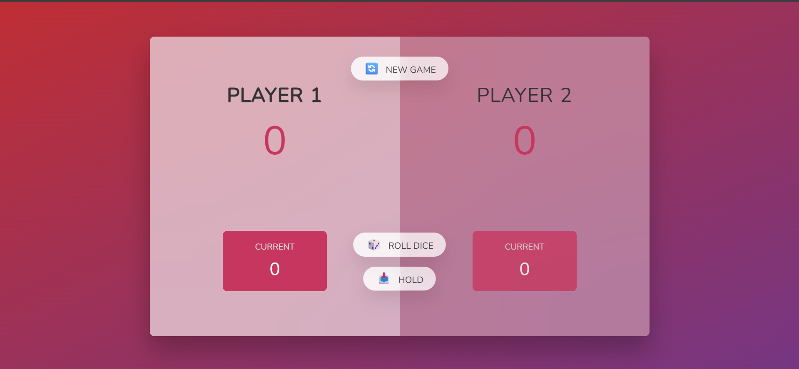

# 📌 Previwe 
<p align="center">
  
</p>
# 🎲 Pig Game (Vanilla JavaScript)

A classic **two-player dice game** built using **HTML, CSS, and Vanilla JavaScript**.  
Players take turns rolling a dice and try to be the first to reach **100 points**.

## 📌 Project Description

This Pig Game is a browser-based game where each player can roll a dice to gain points or hold their current score.  
If a player rolls a **1**, their current score is lost and the turn switches to the other player.

The project demonstrates core JavaScript concepts such as **DOM manipulation**, **event handling**, and **game state management**.

## 🎮 Game Rules

- The game has two players
- Each player rolls the dice during their turn
- Rolling the dice adds the number to the current score
- Rolling **1** resets the current score and switches the player
- Clicking **Hold** saves the current score to the total score
- First player to reach **100 points** wins
- **New Game** resets all scores and restarts the game

## ✨ Features

- Two-player gameplay
- Random dice roll (1–6)
- Active player indicator
- Hold and roll mechanics
- Winner detection system
- Game reset functionality
- Smooth UI transitions and animations

## 🛠️ Technologies Used

- HTML5
- CSS3 (Flexbox, transitions, gradients)
- JavaScript (Vanilla JS)

## 📂 Project Structure

```text
pig-game/
│
├── index.html
├── style.css
├── script.js
└── images/
    ├── dice-1.png
    ├── dice-2.png
    ├── dice-3.png
    ├── dice-4.png
    ├── dice-5.png
    └── dice-6.png
